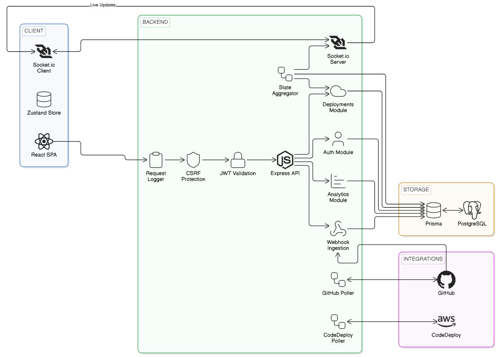

<div align="center">

<h1>DeployLens</h1>

</div>
CI/CD observability platform for unified deployment tracking across GitHub Actions and AWS CodeDeploy.

---

## Overview

DeployLens is a full-stack deployment tracking and observability platform built for engineering teams that want to correlate GitHub Actions workflows and AWS CodeDeploy deployment executions into a single unified timeline. By connecting these disconnected data streams, teams can monitor delivery progress, identify pipeline friction, and verify exactly which commit reached production in real time.

Core design rules:

- Unified status is aggregated from both GHA and AWS CodeDeploy states.
- Commits (SHAs) act as the single source of correlation across environments.
- Deployment state transitions are streamed in real time to connected dashboards.
- Encryption at rest is mandatory for all linked cloud credentials.
- Rollbacks are treated as first-class, auditable deployment events.

---

## Features

**Authentication & Sessions**
- Secure JWT-based access and refresh tokens handled via secure cookies.
- OAuth-based connection mapping with GitHub profiles.
- Secure session lifecycle management with active session indicators.

**Correlation & Deployment Tracking**
- Auto-joins GitHub workflow runs and AWS CodeDeploy deployments by commit SHA.
- Unified status tracking across `pending`, `running`, `success`, `failed`, and `rolled_back`.
- Detail views capturing granular lifecycle events, task durations, and rollback history.

**Dashboard & Analytics**
- Real-time pipeline visualizer streaming updates via Socket.io.
- Advanced filtering by repository, environment, status, branch, and date range.
- Analytics dashboard presenting deployment frequencies, average lead times, and failure rates.

**Security & Administration**
- Robust CSRF protection on all mutating REST endpoints.
- Webhook signature validation to verify incoming payloads from GitHub and AWS.
- AES-256-GCM encryption for storing cloud provider connection credentials.

---

## Tech Stack

| Layer | Technologies |
|---|---|
| Frontend | React, TypeScript, Vite, Zustand |
| Backend | Node.js, Express, TypeScript |
| Database | PostgreSQL 16, Prisma |
| Realtime | Socket.io |
| Security | JWT, CSRF, AES-256-GCM |
| Integrations | GitHub Actions API, AWS CodeDeploy, AWS SDK v3 |

---

## System Architecture Diagram
<div align="center">

</div>

---

## Webhook & Event Ingestion Flow

**Ingestion** — Real-time event capture:
- Receives GitHub Action event payloads and AWS deployment events via secure webhook endpoints (`/api/webhooks/github` and `/api/webhooks/aws`).
- Validates payload signatures to guarantee source origin authenticity.

**Polling** — State synchronization:
- Background poller jobs (`githubPoller` and `codedeployPoller`) query GitHub and AWS APIs dynamically.
- Safeguards against missed webhook deliveries, ensuring absolute state consistency.

**Aggregation**:
- Combines step statuses, matches deployment runs via SHA, and resolves the final `UnifiedStatus`.
- Broadcasts state changes to clients via Socket.io.

---

## Observability & Analytics

DeployLens is designed to give complete visibility into your software delivery lifecycle:

- **Deployment Metrics:** Tracks deployment success rates, deployment frequencies, and environments health.
- **Audit Logging:** Logs user-initiated actions (integrations, rollbacks, configuration updates) with IP addresses and user agents.
- **Lifecycle Event Timeline:** Captures internal execution durations, displaying which steps in your pipeline are bottlenecks.

---

## Security

**Build-time:**
- Strict TypeScript compilation rules to catch type errors during compilation.
- Multi-stage Docker builds to minimize final image attack vectors.
- Strict package dependency locks.

**Runtime:**
- CSRF validation on all mutating REST endpoints.
- Secure cookie-based refresh tokens with token rotation logic.
- Access tokens stored securely in memory.

**Data Security:**
- Encrypted storage of AWS credentials (Access Key ID, Secret Access Key) and GitHub access tokens using AES-256-GCM.

---

## Quick Start

### Prerequisites

```bash
git clone https://github.com/Nirjar26/deploylens.git
cd deploylens
cp .env.example .env
```

Edit `.env` with your values before starting.

### Option 1 — Docker

```bash
docker-compose up --build
```

| Service | URL |
|---|---|
| Frontend | http://localhost:4173 |
| Backend API | http://localhost:3004 |
| Database | localhost:5433 |

### Option 2 — Local Development

Requires Node.js 22+, PostgreSQL 16+.

```bash
# Backend Setup
cd backend
npm install
npx prisma generate
npm run dev        # runs on :3001 (exposes API on :3004 through Docker)

# Frontend Setup
cd ../frontend
npm install
npm run dev        # runs on :5173
```

---

## Project Structure

```
├── backend/          # Node.js Express API, Prisma schema, auth, aggregator, jobs
├── frontend/         # React SPA app, Zustand store, Tailwind CSS styles
├── diagram/          # Architecture visuals
├── docker-compose.yml# Production deployment configuration
```

---

## Documentation

| Category | Links |
|---|---|
| Setup | [Docker Setup](#option-1--docker) · [Local Development](#option-2--local-development) |
| API Specification | [End-point Reference](#api-endpoints) |
| Database Config | [Prisma Schema](backend/prisma/schema.prisma) |

---

## License

MIT License — see [LICENSE](LICENSE)
